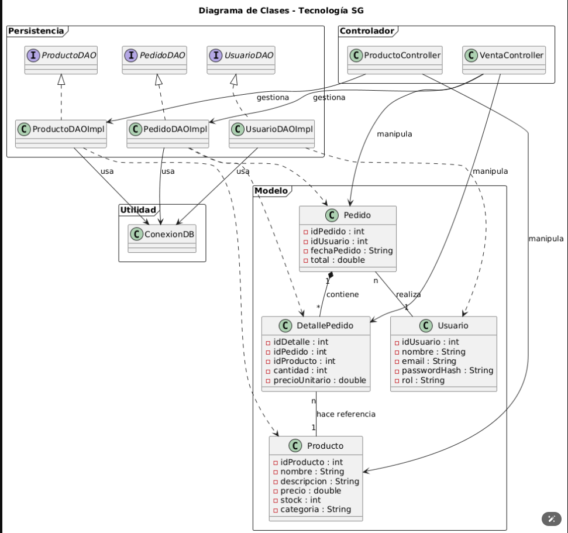

# 💻 Proyecto Integrador 2: Tecnología SG

Aplicación de escritorio para la venta y gestión de inventario de Componentes de PC.

---

## 🧠 Estructura de Clases (Primera Entrega)

A continuación se muestra el diagrama de clases principal del sistema, que define los modelos y la capa de acceso a datos (DAO).

 
---